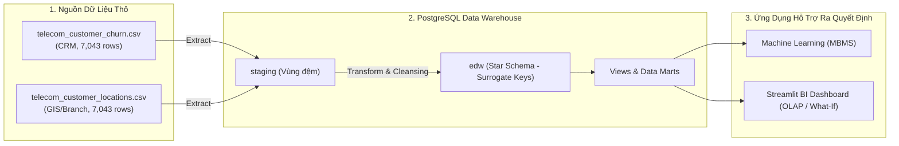

# 📡 CO4031 - TELECOM DATA WAREHOUSE & DECISION SUPPORT SYSTEM (DSS)

> **Trường Đại học Bách Khoa TP.HCM (HCMUT) - Khoa Khoa học & Kỹ thuật Máy tính**  
> **Môn học**: Kho dữ liệu và Hệ hỗ trợ ra quyết định (CO4031)  
> **Repository**: [tutrong2706/co4031-telecom-dss](https://github.com/tutrong2706/co4031-telecom-dss)  
> **Nhánh làm việc**: `main` / `feature/data-engineering`

---

## 📖 1. TỔNG QUAN DỰ ÁN (PROJECT OVERVIEW)

Hệ thống **Telecom DSS** là giải pháp hỗ trợ ra quyết định toàn diện cho doanh nghiệp viễn thông, được xây dựng theo kiến trúc 3 thành phần tiêu chuẩn:
1. **DBMS / Data Warehouse (EDW)**: Kho dữ liệu trung tâm thiết kế theo mô hình đa chiều **Star Schema** (Inmon 3-tier + Ralph Kimball modeling) trên **PostgreSQL 18**.
2. **MBMS (Model Management)**: 3 mô hình khai phá dữ liệu & học máy (Phân loại Churn, Phân cụm Khách hàng K-Means, Dự báo Giá trị vòng đời CLV).
3. **User Interface / DSS Dashboard**: Giao diện trực quan hóa **Streamlit** hỗ trợ phân tích đa chiều OLAP (Drill-down, Slice/Dice) và mô phỏng chính sách (**What-If Analysis**).



---

## 🗂️ 2. CẤU TRÚC THƯ MỤC DỰ ÁN (PROJECT STRUCTURE)

```text
co4031-telecom-dss/
├── data/                                  # Dữ liệu phục vụ dự án
│   ├── raw/                               # Dữ liệu thô ban đầu (CRM + GIS)
│   └── processed/                         # Dữ liệu sạch đã xuất từ Data Marts phục vụ ML/BI
│
├── sql/                                   # Kịch bản DDL Cơ sở dữ liệu
│   ├── ddl/                               # 01_staging_schema.sql, 02_dw_star_schema.sql, 03_indexes_and_views.sql
│   └── views/                             # SQL Views nghiệp vụ
│
├── etl/                                   # Quy trình ETL tự động hóa
│   └── etl_pipeline.py                    # Script chạy toàn bộ pipeline ETL (Extract -> Transform -> Load -> Audit)
│
├── models/                                # Huấn luyện mô hình Machine Learning (Phase 2)
│
├── app/                                   # Giao diện Streamlit DSS Dashboard & What-If (Phase 3)
│
├── scripts/                               # Các công cụ tiện ích hỗ trợ
│   ├── data_profiling.py                  # Script khảo sát EDA & kiểm định chất lượng dữ liệu thô
│   ├── db_manager.py                      # Tự động tạo DB telecom_dw và khởi tạo DDL
│   ├── test_postgres_connection.py        # Kiểm tra kết nối & cấu hình mật khẩu DB
│   ├── verify_db_schema.py                # Kiểm tra cấu trúc bảng & khóa ngoại trong DB
│   └── export_data_marts.py               # Xuất Views ra file CSV trong data/processed/
│
├── docs/                                  # Toàn bộ tài liệu báo cáo & đặc tả kỹ thuật
│   ├── data_profiling_report.md           # Báo cáo đánh giá chất lượng dữ liệu thô (Task 1)
│   ├── data_dictionary.md                 # Từ điển dữ liệu giải thích ý nghĩa từng trường
│   ├── dimensional_modeling_design.md     # Tài liệu thiết kế 4 bước Kimball, Bus Matrix & ERD (Task 2)
│   ├── data_lineage_and_metadata.md       # Sơ đồ dòng chảy dữ liệu End-to-End & Metadata
│   ├── data_marts_handoff.md              # Biên bản bàn giao Data Mart cho team ML & Dashboard (Task 5)
│   ├── data_engineering_report.md         # Báo cáo chuyên đề Data Engineering (Task 6)
│   └── roles/                             # Tài liệu quy chuẩn cho từng vai trò (Data, ML, Dashboard)
│
├── checkpoints.md                         # Checklist theo dõi tiến độ các task
├── requirements.txt                       # Danh mục các thư viện Python
├── .env.example                           # Mẫu cấu hình biến môi trường Database
├── .gitignore                             # Cấu hình loại trừ cache, env, venv
└── README.md                              # Tài liệu hướng dẫn trang chủ
```

---

## 🛠️ 3. MÔ TẢ CHI TIẾT CÁC FILE CODE VÀ CHỨC NĂNG

1. **[`etl/etl_pipeline.py`](file:///c:/Users/Admin/Desktop/Education/Year%204/HK261/Data%20Warehouse/telecom/co4031-telecom-dss/etl/etl_pipeline.py)**:
   - **Extract**: Đọc dữ liệu từ 2 nguồn CSV và nạp trung gian vào schema `staging`.
   - **Transform**: Xử lý 11 giá trị rỗng của `TotalCharges`, chuẩn hóa các cột boolean (`is_senior_citizen`, `has_partner`, các gói Add-ons), phân nhóm thâm niên `tenure_group`, phân loại hình thức thanh toán, tính toán các chỉ số kinh doanh phái sinh (`estimated_annual_charges`, `avg_charges_per_tenure`, `clv_proxy`).
   - **Load**: Nạp theo thứ tự toàn vẹn tham chiếu: `dim_date` $\rightarrow$ `dim_customer` $\rightarrow$ `dim_location` $\rightarrow$ `dim_service` $\rightarrow$ `dim_contract` $\rightarrow$ sinh **Surrogate Keys** $\rightarrow$ Tra cứu khóa ngoại và nạp **7,043 bản ghi** vào `fact_customer_subscription_monthly`.
   - **Quality Audit**: Tự động kiểm tra số lượng dòng, kiểm tra khóa ngoại mồ côi (0 orphan FKs) và tính sẵn sàng của các Views.

2. **[`scripts/db_manager.py`](file:///c:/Users/Admin/Desktop/Education/Year%204/HK261/Data%20Warehouse/telecom/co4031-telecom-dss/scripts/db_manager.py)**:
   - Tự động kết nối tới PostgreSQL, tạo cơ sở dữ liệu `telecom_dw` nếu chưa có.
   - Tự động thực thi tuần tự các file DDL (`01_staging_schema.sql`, `02_dw_star_schema.sql`, `03_indexes_and_views.sql`).

3. **[`scripts/test_postgres_connection.py`](file:///c:/Users/Admin/Desktop/Education/Year%204/HK261/Data%20Warehouse/telecom/co4031-telecom-dss/scripts/test_postgres_connection.py)**:
   - Kiểm tra kết nối tới PostgreSQL, hỗ trợ kiểm tra mật khẩu từ `.env` hoặc truyền danh sách mật khẩu qua CLI để tìm mật khẩu đúng và tự động ghi vào `.env`.

4. **[`scripts/export_data_marts.py`](file:///c:/Users/Admin/Desktop/Education/Year%204/HK261/Data%20Warehouse/telecom/co4031-telecom-dss/scripts/export_data_marts.py)**:
   - Trích xuất dữ liệu từ các SQL Views (`edw.vw_bi_churn_analytics` và `edw.vw_ml_feature_store`) ra các file CSV chuẩn hóa đặt tại `data/processed/` để phục vụ các thành viên làm ML và Dashboard.

5. **[`scripts/data_profiling.py`](file:///c:/Users/Admin/Desktop/Education/Year%204/HK261/Data%20Warehouse/telecom/co4031-telecom-dss/scripts/data_profiling.py)**:
   - Thực hiện EDA, kiểm tra kiểu dữ liệu, tỷ lệ rỗng, trùng lặp và tương hợp khóa giữa 2 nguồn dữ liệu thô.

---

## 🚀 4. HƯỚNG DẪN CÀI ĐẶT VÀ CHẠY DỰ ÁN

### Bước 1: Cài đặt thư viện Python
```bash
pip install -r requirements.txt
```

### Bước 2: Cấu hình PostgreSQL trong file `.env`
Tạo file `.env` (hoặc copy từ `.env.example`) và điền thông tin:
```env
DB_HOST=localhost
DB_PORT=5432
DB_NAME=telecom_dw
DB_USER=postgres
DB_PASSWORD=your_password
```

### Bước 3: Khởi tạo Database và Star Schema
```bash
python scripts/db_manager.py
```

### Bước 4: Chạy Pipeline ETL nạp dữ liệu vào Kho
```bash
python etl/etl_pipeline.py
```

### Bước 5: Xuất dữ liệu Data Marts phục vụ ML & Dashboard
```bash
python scripts/export_data_marts.py
```

---

## 📊 5. TIẾN ĐỘ THỰC HIỆN (CHECKPOINTS)

Xem chi tiết tiến độ tại file [checkpoints.md](file:///c:/Users/Admin/Desktop/Education/Year%204/HK261/Data%20Warehouse/telecom/co4031-telecom-dss/checkpoints.md):
- [x] **Task 1**: Khảo sát & Khám phá dữ liệu thô (Data Profiling) - *Hoàn thành*
- [x] **Task 2**: Thiết kế Mô hình Đa chiều (Dimensional Modeling & Star Schema) - *Hoàn thành*
- [x] **Task 3**: Cài đặt Cơ sở dữ liệu Kho dữ liệu (DDL Implementation) - *Hoàn thành*
- [x] **Task 4**: Xây dựng Quy trình tự động ETL (Extract, Transform, Load) - *Hoàn thành*
- [x] **Task 5**: Xuất Data Marts & Views bàn giao cho ML và Dashboard - *Hoàn thành*
- [x] **Task 6**: Quản lý Metadata, Git & Viết Báo cáo chuyên đề - *Hoàn thành*
