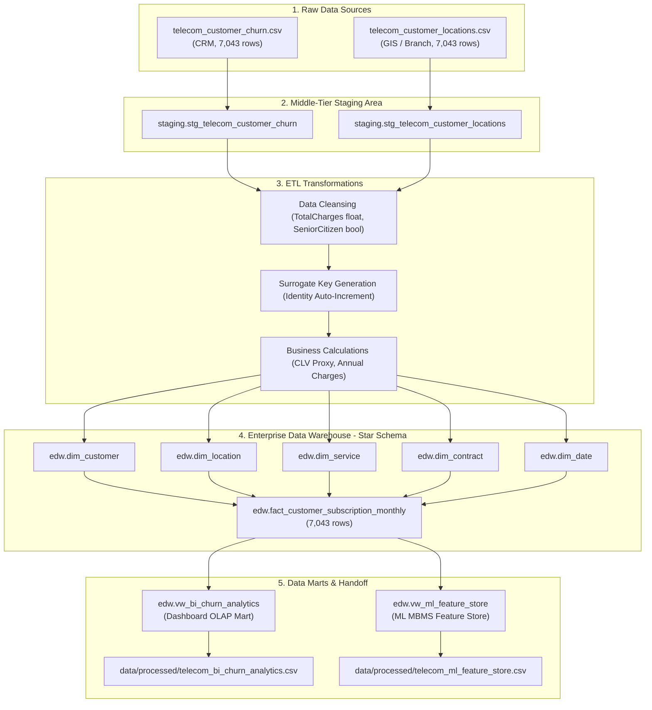

# 🌳 DATA LINEAGE & METADATA CATALOG (CO4031)

**Dự án**: CO4031 - Telecom Data Warehouse & Decision Support System (DSS)  
**Nhánh**: `feature/data-engineering` | **Database**: PostgreSQL 18 (`telecom_dw`)

---

## 1. DÒNG CHẢY DỮ LIỆU ĐẦU - CUỐI (END-TO-END DATA LINEAGE)

---

## 2. METADATA CATALOG CỦA KHO DỮ LIỆU (EDW)

| Tên Bảng / View | Loại Đối Tượng | Số Cột | Khóa Chính (PK) | Mục Đích Nghiệp Vụ |
| :--- | :--- | :---: | :--- | :--- |
| `edw.dim_customer` | Dimension Table | 8 | `customer_key` (Surrogate) | Quản lý thuộc tính nhân khẩu học & phân nhóm thâm niên |
| `edw.dim_location` | Dimension Table | 8 | `location_key` (Surrogate) | Quản lý địa bàn, chi nhánh và tọa độ địa lý |
| `edw.dim_service` | Dimension Table | 11 | `service_key` (Surrogate) | Quản lý cấu hình gói cước thoại, internet & add-ons |
| `edw.dim_contract` | Dimension Table | 6 | `contract_key` (Surrogate) | Quản lý kỳ hạn hợp đồng & hình thức thanh toán |
| `edw.dim_date` | Dimension Table | 8 | `date_key` (YYYYMMDD) | Chiều thời gian phục vụ phân tích theo chu kỳ |
| `edw.fact_customer_subscription_monthly` | Fact Table | 14 | `fact_id` (BigSerial) | Lưu trữ các độ đo doanh thu, cước phí, CLV & cờ Churn |
| `edw.vw_bi_churn_analytics` | Data Mart View | 38 | N/A | Cung cấp dữ liệu đã JOIN hoàn chỉnh cho Streamlit Dashboard |
| `edw.vw_ml_feature_store` | Feature Store View | 27 | N/A | Cung cấp tập đặc trưng sạch cho 3 mô hình ML (MBMS) |
