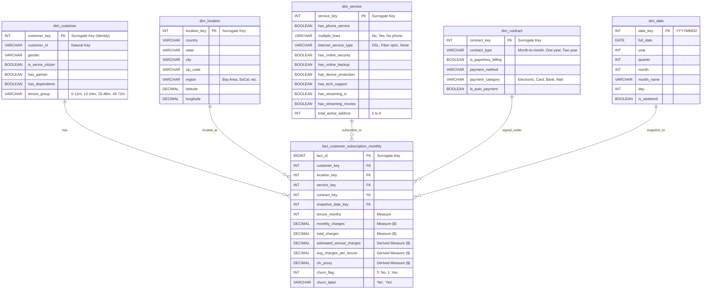

# 📐 THIẾT KẾ MÔ HÌNH ĐA CHIỀU (DIMENSIONAL MODELING & STAR SCHEMA)

**Dự án**: CO4031 - Telecom Data Warehouse & Decision Support System (DSS)  
**Môn học**: Kho dữ liệu & Hệ hỗ trợ ra quyết định (CO4031 - ĐH Bách Khoa TP.HCM)  
**Tác giả**: Data Engineer Agent | **Nhánh**: `feature/data-engineering`

---

## 1. QUY TRÌNH THIẾT KẾ 4 BƯỚC THEO CHUẨN KIMBALL

### Bước 1: Chọn Quy trình Nghiệp vụ (Select the Business Process)
Quy trình nghiệp vụ cốt lõi của công ty viễn thông cần theo dõi là **Quản lý Thuê bao, Doanh thu Cước phí & Hành vi Rời mạng của Khách hàng (Customer Subscription, Billing & Churn Management)**.

### Bước 2: Xác định Hạt dữ liệu (Declare the Grain)
- **Hạt dữ liệu (Grain)**: Đặt ở mức chi tiết nguyên tử (Atomic level): **Một bản ghi cho mỗi khách hàng thuê bao trong một kỳ cước/chu kỳ phân tích (Periodic Snapshot Grain)**.

### Bước 3: Xác định các Bảng Chiều (Identify Dimensions)
1. **`dim_customer`**: Lưu thông tin nhân khẩu học và thuộc tính khách hàng.
2. **`dim_location`**: Lưu thông tin địa lý, chi nhánh, vùng thị trường và tọa độ GIS.
3. **`dim_service`**: Lưu cấu hình gói cước, công nghệ mạng (DSL/Fiber) và các dịch vụ giá trị gia tăng (Add-ons).
4. **`dim_contract`**: Lưu hình thức hợp đồng cam kết, phương thức thanh toán và hóa đơn điện tử.
5. **`dim_date`**: Chiều thời gian chuẩn hóa phục vụ phân tích xu hướng và lát cắt theo Năm/Quý/Tháng.

> ⚠️ **Nguyên tắc bắt buộc**: Tất cả các bảng Dimension đều sử dụng **Surrogate Key** (Khóa thay thế kiểu `INTEGER` / `BIGINT` tự tăng) làm Khóa chính (PK), tách biệt hoàn toàn với Natural Key (`customerID`).

### Bước 4: Xác định các Độ đo trong Bảng Sự kiện (Identify the Facts & Measures)
- **Bảng Fact**: `fact_customer_subscription_monthly`
- **Các độ đo định lượng (Quantitative Measures)**:
  - `tenure_months` (Tháng gắn bó - Additive)
  - `monthly_charges` (Cước phí định kỳ hàng tháng - Additive)
  - `total_charges` (Tổng cước lũy kế - Semi-additive)
  - `estimated_annual_charges` (Ước tính doanh thu năm = `monthly_charges * 12`)
  - `avg_charges_per_tenure` (Cước bình quân mỗi tháng = `total_charges / tenure`)
  - `clv_proxy` (Chỉ số ước lượng Giá trị vòng đời khách hàng = `tenure * monthly_charges`)
- **Degenerate Dimension / Cờ trạng thái**:
  - `churn_flag` (0: Ở lại, 1: Rời mạng)
  - `churn_label` ('No', 'Yes')

---

## 2. MA TRẬN BUS MATRIX (ENTERPRISE DATA WAREHOUSE BUS MATRIX)

| Business Process (Quy trình nghiệp vụ) | `dim_customer` | `dim_location` | `dim_service` | `dim_contract` | `dim_date` | Fact Table tương ứng |
| :--- | :---: | :---: | :---: | :---: | :---: | :--- |
| **Customer Subscription Snapshot** | ✅ | ✅ | ✅ | ✅ | ✅ | `fact_customer_subscription_monthly` |
| **Churn & Risk Analytics (ML Mart)** | ✅ | ✅ | ✅ | ✅ | ✅ | `vw_ml_churn_feature_store` |
| **Revenue & Billing Analysis (BI Mart)** | ✅ | ✅ | ✅ | ✅ | ✅ | `vw_bi_revenue_analytics` |

---

## 3. SƠ ĐỒ MÔ HÌNH STAR SCHEMA (ERD)

---

## 4. CHI TIẾT ĐỊNH NGHĨA CÁC BẢNG (DATA DICTIONARY CẤU TRÚC DW)

### 4.1. Bảng Chiều Khách hàng (`dim_customer`)
- **Grain**: Một bản ghi cho mỗi khách hàng duy nhất.
- **Chiến lược SCD**: Slowly Changing Dimension Type 1 (Ghi đè thông tin mới nhất).
- **Thuộc tính**:
  - `customer_key` (`INT GENERATED ALWAYS AS IDENTITY PRIMARY KEY`): Surrogate Key.
  - `customer_id` (`VARCHAR(30) NOT NULL UNIQUE`): Mã khách hàng từ hệ thống CRM.
  - `gender` (`VARCHAR(10)`): 'Male', 'Female'.
  - `is_senior_citizen` (`BOOLEAN`): TRUE nếu là người cao tuổi.
  - `has_partner` (`BOOLEAN`): TRUE nếu có bạn đời/vợ chồng.
  - `has_dependents` (`BOOLEAN`): TRUE nếu có người phụ thuộc.
  - `tenure_group` (`VARCHAR(20)`): Phân đoạn thời gian ('0-12 Months', '13-24 Months', '25-48 Months', '49-72 Months').

### 4.2. Bảng Chiều Vị trí Địa lý (`dim_location`)
- **Grain**: Một bản ghi cho mỗi địa điểm / mã bưu chính duy nhất.
- **Thuộc tính**:
  - `location_key` (`INT GENERATED ALWAYS AS IDENTITY PRIMARY KEY`): Surrogate Key.
  - `country` (`VARCHAR(50)`): 'United States'.
  - `state` (`VARCHAR(50)`): 'California'.
  - `city` (`VARCHAR(100)`): Los Angeles, San Francisco, v.v.
  - `zip_code` (`VARCHAR(20)`): Mã bưu chính.
  - `region` (`VARCHAR(50)`): Vùng kinh tế/quản lý viễn thông.
  - `latitude`, `longitude` (`DECIMAL(10, 6)`): Tọa độ địa lý.

### 4.3. Bảng Chiều Dịch vụ (`dim_service`)
- **Grain**: Một bản ghi cho mỗi tổ hợp cấu hình gói cước và dịch vụ phụ trợ.
- **Thuộc tính**:
  - `service_key` (`INT GENERATED ALWAYS AS IDENTITY PRIMARY KEY`): Surrogate Key.
  - `has_phone_service` (`BOOLEAN`)
  - `multiple_lines` (`VARCHAR(30)`)
  - `internet_service_type` (`VARCHAR(30)`): DSL, Fiber optic, No
  - `has_online_security` (`BOOLEAN`)
  - `has_online_backup` (`BOOLEAN`)
  - `has_device_protection` (`BOOLEAN`)
  - `has_tech_support` (`BOOLEAN`)
  - `has_streaming_tv` (`BOOLEAN`)
  - `has_streaming_movies` (`BOOLEAN`)
  - `total_active_addons` (`INT`): Tổng số dịch vụ gia tăng đang sử dụng (0 - 6).

### 4.4. Bảng Chiều Hợp đồng & Thanh toán (`dim_contract`)
- **Grain**: Một bản ghi cho mỗi gói điều khoản cam kết & phương thức thanh toán.
- **Thuộc tính**:
  - `contract_key` (`INT GENERATED ALWAYS AS IDENTITY PRIMARY KEY`): Surrogate Key.
  - `contract_type` (`VARCHAR(50)`): Month-to-month, One year, Two year.
  - `is_paperless_billing` (`BOOLEAN`)
  - `payment_method` (`VARCHAR(100)`): Electronic check, Mailed check, v.v.
  - `payment_category` (`VARCHAR(50)`): Electronic, Card, Bank, Mail.
  - `is_auto_payment` (`BOOLEAN`): TRUE nếu thanh toán tự động (Bank/Credit Card).

### 4.5. Bảng Chiều Thời gian (`dim_date`)
- **Grain**: Một bản ghi cho mỗi ngày lịch.
- **Thuộc tính**:
  - `date_key` (`INT PRIMARY KEY`): Định dạng YYYYMMDD (ví dụ: `20261008`).
  - `full_date` (`DATE`)
  - `year` (`INT`), `quarter` (`INT`), `month` (`INT`), `month_name` (`VARCHAR(20)`), `day` (`INT`).
  - `is_weekend` (`BOOLEAN`).

### 4.6. Bảng Sự kiện Thuê bao Hàng tháng (`fact_customer_subscription_monthly`)
- **Grain**: 1 bản ghi / khách hàng / chu kỳ phân tích.
- **Foreign Keys**:
  - `customer_key` $\rightarrow$ `dim_customer(customer_key)`
  - `location_key` $\rightarrow$ `dim_location(location_key)`
  - `service_key` $\rightarrow$ `dim_service(service_key)`
  - `contract_key` $\rightarrow$ `dim_contract(contract_key)`
  - `snapshot_date_key` $\rightarrow$ `dim_date(date_key)`
- **Measures**:
  - `tenure_months` (`INT`): Số tháng hoạt động.
  - `monthly_charges` (`DECIMAL(10, 2)`): Cước phí hàng tháng ($).
  - `total_charges` (`DECIMAL(12, 2)`): Tổng cước phí ($).
  - `estimated_annual_charges` (`DECIMAL(12, 2)`): Ước tính cước phí 1 năm.
  - `avg_charges_per_tenure` (`DECIMAL(10, 2)`): Cước trung bình mỗi tháng đã dùng.
  - `clv_proxy` (`DECIMAL(12, 2)`): Giá trị vòng đời ước tính.
  - `churn_flag` (`INT`): 0 (ở lại), 1 (rời mạng).
  - `churn_label` (`VARCHAR(10)`): 'No', 'Yes'.

---

## 5. ĐÁNH GIÁ ĐÁP ỨNG CHUẨN ĐẦU RA BTL CO4031
1. **Chuẩn Inmon / Kimball**: Kiến trúc 3 tầng (Staging $\rightarrow$ Star Schema EDW $\rightarrow$ Data Marts).
2. **Surrogate Keys**: 100% các bảng Dimension đều có Surrogate Key tự tăng, giải quyết triệt để vấn đề ràng buộc khóa tự nhiên từ hệ thống nguồn.
3. **Phục vụ trọn vẹn cho ML & BI**:
   - Classification: Cung cấp đầy đủ biến nhân khẩu học, dịch vụ, hợp đồng và cờ `churn_flag`.
   - Clustering: Cung cấp các đặc trưng số (`tenure_months`, `monthly_charges`, `total_active_addons`, `total_charges`).
   - Regression: Cung cấp biến mục tiêu cước phí (`monthly_charges`, `total_charges`, `clv_proxy`).
   - BI Dashboard: Dễ dàng thực hiện các thao tác OLAP (Drill-down theo Vùng $\rightarrow$ Thành phố, Slice/Dice theo Hợp đồng và Dịch vụ).
