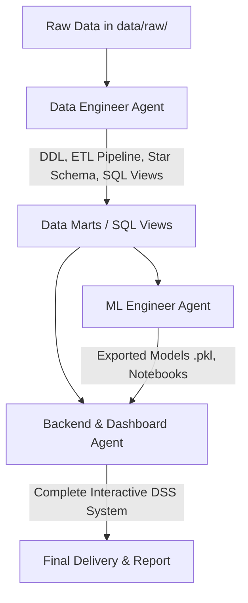

# SKILL: CO4031 ASSIGNMENT WORKFLOW & QUALITY GATES

## 1. QUY CÁCH NỘP BÀI (DEADLINE: 23:59 - 15/11/2026)
Mọi file nộp phải nén thành 1 file ZIP duy nhất chứa đúng cấu trúc thư mục sau:
- `Report.pdf`: Báo cáo chi tiết (soạn bằng Typst / LaTeX / Word).
- `src/`: Toàn bộ mã nguồn (SQL scripts, Python ETL, ML notebooks, Backend API, Dashboard).
- `data/`: File dữ liệu mẫu và đường dẫn tới dữ liệu đầy đủ.
- `Slides.pdf`: Slide trình bày báo cáo.
- Trang bìa Báo cáo: Bắt buộc đính kèm Link Video thuyết trình (YouTube Unlisted / Google Drive 10–15 phút).

## 2. QUY TRÌNH PHỐI HỢP GIT (BRANCHING STRATEGY)
- Nhánh `main`: Chỉ chứa bản phát hành chính thức nộp bài.
- Nhánh `dev`: Tích hợp code chung của cả nhóm.
- Nhánh tính năng riêng:
  - `feature/data-engineering` (Data Warehouse, Star Schema, ETL, SQL Views)
  - `feature/ml-models` (Machine Learning, MBMS, Notebooks, Model Export)
  - `feature/backend-dashboard` (FastAPI/Streamlit Dashboard, DSS What-If UI)
- Mọi thay đổi phải tạo Pull Request (PR) và được nhóm review trước khi merge vào `dev`.

## 3. THỨ TỰ THỰC THI TUẦN TỰ GIỮA CÁC AGENT (PIPELINE HANDOFF)

## 4. QUALITY GATES (TIÊU CHÍ KIỂM ĐỊNH CHẤT LƯỢNG)
- **Data Engineering**:
  - [x] Có bảng Staging trung gian.
  - [x] Bảng Chiều (Dimension) bắt buộc có **Surrogate Key**.
  - [x] Bảng Fact liên kết chuẩn FK tới các Dim.
  - [x] Không để Agent ML đọc file CSV thô trực tiếp mà phải qua SQL Views / Data Marts chuẩn hóa.
- **Machine Learning**:
  - [x] Đáp ứng đủ 3 bài toán: Classification (Churn), Clustering (Segmentation), Prediction/Regression (CLV/Billing).
  - [x] Đánh giá đầy đủ metrics (Accuracy, F1, AUC, Silhouette, RMSE).
  - [x] Đóng gói model `.pkl` cho UI gọi.
- **Backend & Dashboard**:
  - [x] Hỗ trợ thao tác phân tích OLAP (Drill-down, Slice/Dice).
  - [x] Có giao diện What-If Analysis cho nhà quản lý nhập thông số thử nghiệm.
